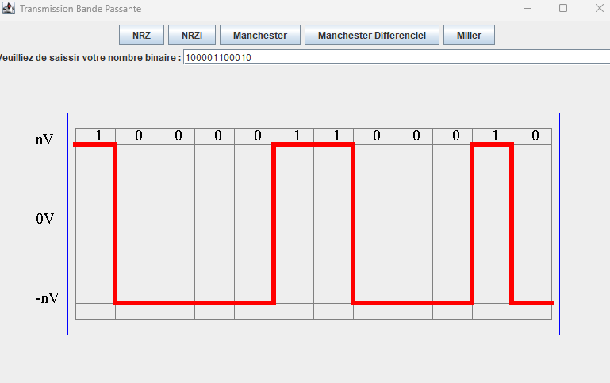
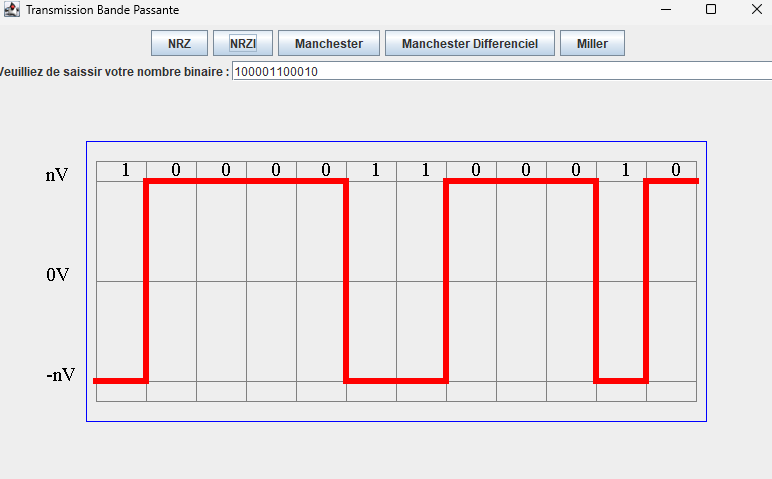
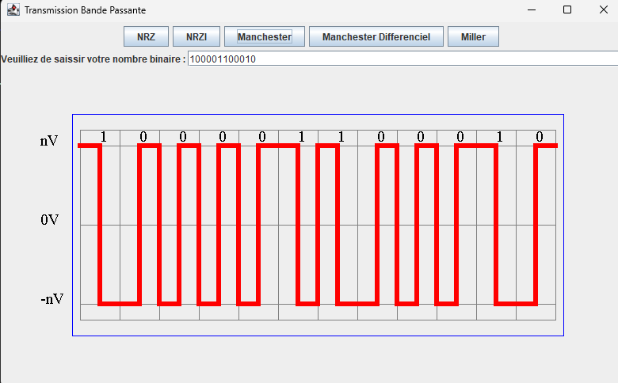
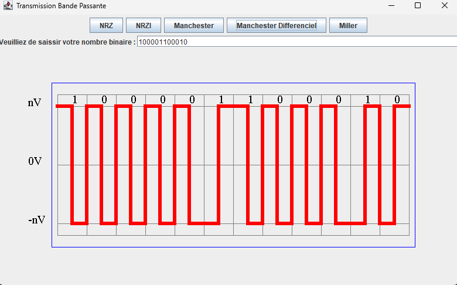
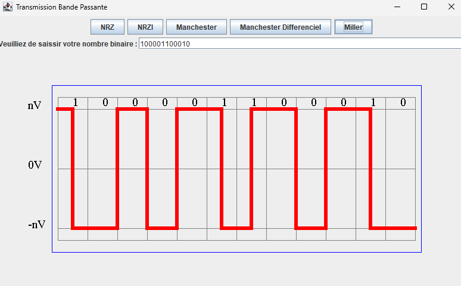

<h1>ANDONI ALONSO TORT</h1>

Creation d'un programme pour afficher les differentes codes de transmission de bande passante (NRZ, NRZI, MANCHESTER, MANCHESTER DIFFERENTIEL, MILLER) en utilisant JFrame en Java pour dessiner la representation de bits.

[NRZ](https://es.wikipedia.org/wiki/Códigos_NRZ) : Le moyen le plus courant et le plus simple de transmettre des signaux numériques consiste à utiliser un niveau de tension différent pour chacun des bits. Les codes qui suivent cette stratégie partagent la propriété que le niveau de tension reste constant pendant toute la durée du bit, c'est-à-dire qu'il n'y a pas de transitions (il n'y a pas de retour au niveau de tension zéro). Par exemple, l’absence de tension peut être utilisée pour représenter un 0 binaire, tandis qu’un niveau de tension constant et positif peut représenter 1.

[NRZI](https://es.wikipedia.org/wiki/Códigos_NRZ) : Le code NRZI5​ (Non-Returning Inverted Zero) est un moyen de coder et de mapper un signal binaire en signal numérique pour la transmission sur un support, et est moins utilisé que le code NRZ.

Les signaux NRZI peuvent avoir une transition s'ils transmettent un 1 logique et n'ont pas de transition s'ils transmettent un 0 logique (gardez à l'esprit que le système binaire est un système de numérotation composé uniquement de 0 et 1).

[MANCHESTER](https://fr.wikipedia.org/wiki/Codage_Manchester) : Le codage Manchester est un codage synchrone, ce qui signifie que, outre les données à transmettre, les signaux transmis intègrent également l'horloge de synchronisation nécessaire à leur décodage. Il est utilisé dans les réseaux informatiques pour injecter sur le média physique (couche 1 du modèle OSI) les valeurs logiques correspondant au flux d'entrée.

Les transitions du signal codé transmettent à la fois la valeur logique du bit (0 ou 1) et l'instant de son échantillonnage. Une transition intermédiaire est ajoutée lorsque des bits de même valeur se suivent.

[MANCHESTER  DIFFERENTIEL](https://fr.wikipedia.org/wiki/Codage_Manchester_différentiel) : Le codage Manchester Differentiel est utilisé dans les réseaux informatiques pour injecter sur le média physique (couche 1 du modèle OSI) les valeurs logiques correspondant au flux d'entrée.

<table>
<thead>
    <th>Valeurs à coder</th>
    <th>Valeurs transmise</th>
</thead>
<tbody>
    <tr>
        <td>
            0 logique
        </td>
        <td>
            Transition dans le même sens que la précédente au début de l'intervalle.
        </td>
    </tr>
    <tr>
        <td>1 logique</td>
        <td>Transition dans le sens inverse de la précédente au milieu de l'intervalle.</td>
    </tr>
</tbody>
</table>

[MILLER](https://fr.wikipedia.org/wiki/Codage_Miller) : 
ignal intermédiaire identique au codage Manchester, puis suppression d'une transition sur deux.

Le codage peut être réalisé de la manière suivante :

<ul>
    <li>
        Transition (front montant ou descendant) au milieu du bit "1"
    </li>
    <li>
        Pas de transition au milieu du bit "0"
    </li>
    <li>
        Une transition en fin de bit "0" si celui-ci est suivi d'un autre "0"
    </li>
</ul>

<h2>Images</h2>

Nombre decimale: 2146
Binaire: 100001100010

<h3>NRZ</h3>

<h3>NRZI</h3>

<h3>MANCHESTER</h3>

<h3>MANCHESTER DIFFERENCIEL</h3>

<h3>MILLER</h3>

Developed with [Java Swing](https://en.wikipedia.org/wiki/Swing_(Java))

Swing is a GUI widget toolkit for Java. It is part of Oracle's Java Foundation Classes (JFC) – an API for providing a graphical user interface (GUI) for Java programs.